# wallpapers

Personal collection of 600+ wallpapers organized by theme and color scheme, installable via Nix.

## Directory Structure

```
wallpapers/
├── catppuccin/     # Catppuccin color scheme (~143 wallpapers)
├── tokyonight/     # Tokyo Night theme (~105 wallpapers)
├── nordic/         # Nordic/Nord theme (~115 wallpapers)
├── gruvbox/        # Gruvbox color scheme (~40 wallpapers)
├── rosepine/       # Rosé Pine theme (~35 wallpapers)
├── dracula/        # Dracula theme (~20 wallpapers)
├── cyberdream/     # Cyberdream theme
├── decay/          # Decay theme
├── graphite/       # Graphite theme
├── kanagawa/       # Kanagawa theme
├── solarized/      # Solarized theme
└── unorganized/    # Unsorted wallpapers
```

## Usage with Nix

This repository is a Nix flake. Add it to your flake inputs:

```nix
{
  inputs = {
    nixpkgs.url = "github:NixOS/nixpkgs/nixos-unstable";
    wallpapers.url = "github:yourusername/wallpapers";
  };

  outputs = {nixpkgs, wallpapers, ...}: {
    # Example: Use a specific wallpaper
    # wallpapers.wallpapers.tokyonight.anime.path

    # Example: Filter wallpapers by tag
    homeConfigurations.youruser = {
      home.file."Pictures/catppuccin-walls" = {
        source = let
          catppuccinWalls = builtins.filter
            (wall: builtins.elem "catppuccin" wall.tags)
            (builtins.attrValues wallpapers.wallpapers);
        in catppuccinWalls;
      };
    };
  };
}
```

### Accessing Wallpapers

Each wallpaper has the following attributes:
- `path` - Full path to the wallpaper file
- `tags` - List of tags derived from filename (split by `-`)
- `hash` - MD5 hash for verification

Example:
```nix
# Access: wallpapers.wallpapers.catppuccin.anime-girl
# Returns: { path = "..."; tags = ["anime", "girl"]; hash = "..."; }
```

## Preview

**Total wallpapers: 638**

### catppuccin (143 wallpapers)

|||
|-|-|
|<br>**2b.png**|<br>**4k-ai-mountain.jpg**|
|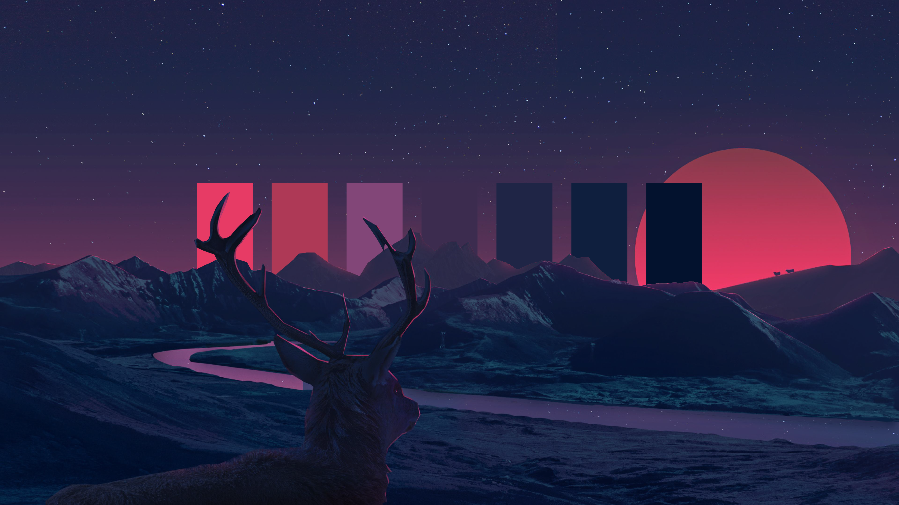<br>**aesthetic_deer.png**|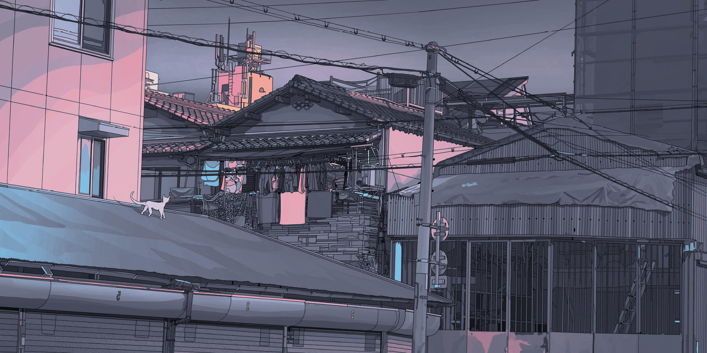<br>**aesthetic-japan.jpg**|
|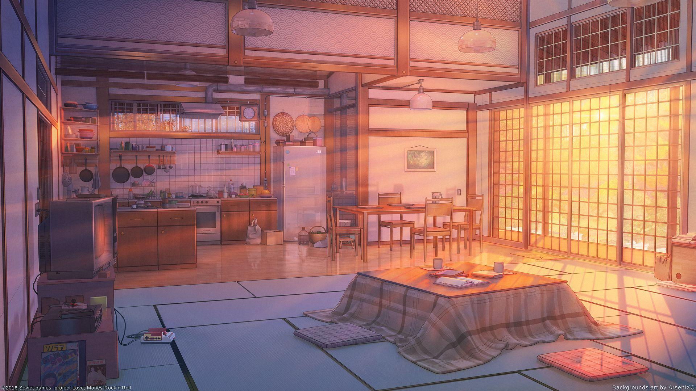<br>**anime1.jpeg**|<br>**anime-4k-uvwsx2m7duh51ale.jpg**|

### cyberdream (16 wallpapers)

|||
|-|-|
|<br>**acrylic.jpg**|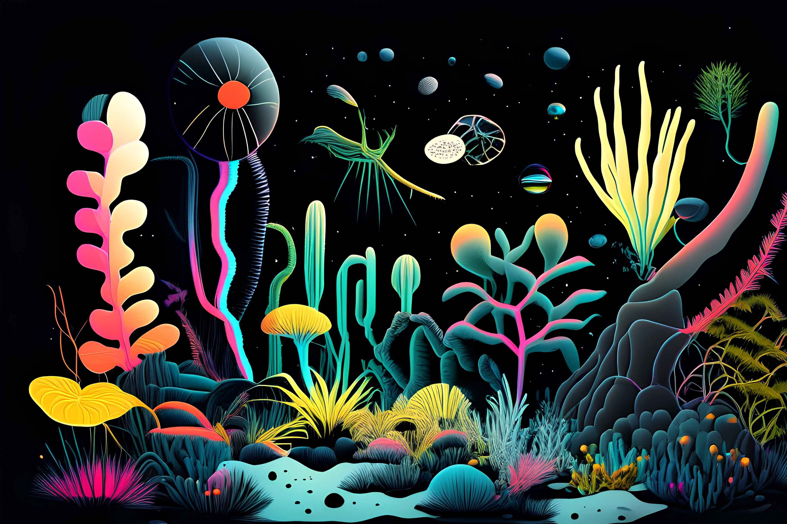<br>**alien_planet.jpeg**|
|<br>**beach.jpg**|<br>**cliff-edge.jpg**|
|<br>**cyber-girl.jpg**|<br>**cyberpunk_car.png**|

### decay (12 wallpapers)

|||
|-|-|
|<br>**abandoned.jpg**|<br>**abstract.jpg**|
|<br>**arcade_decay_red.png**|<br>**beach_landscape.png**|
|<br>**black-white-girl.png**|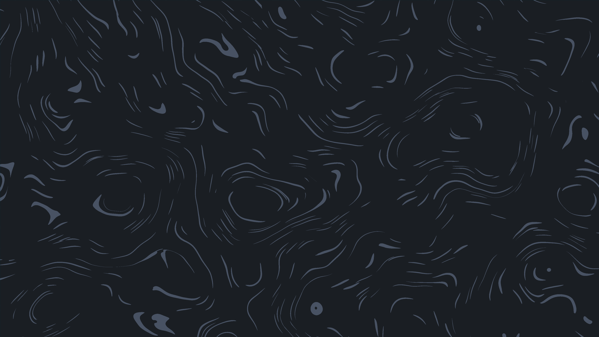<br>**blue_swirl.png**|

### dracula (20 wallpapers)

|||
|-|-|
|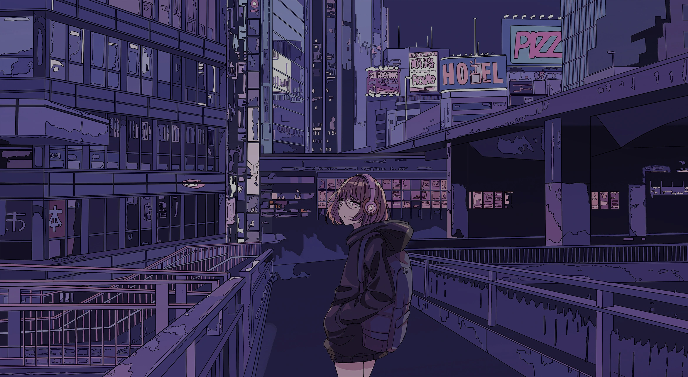<br>**Cristina.png**|<br>**evangelion-dracula+.png**|
|<br>**evangelion-end.jpg**|<br>**evangelion-grey.jpg**|
|<br>**evangelion-hot.jpg**|<br>**evangelion-night.jpg**|

### graphite (12 wallpapers)

|||
|-|-|
|<br>**chainsawman_sketch.png**|<br>**cybergirl.jpg**|
|<br>**gojo.png**|<br>**japan_lake.jpg**|
|<br>**limbo.jpg**|<br>**min_mountain.jpg**|

### gruvbox (40 wallpapers)

|||
|-|-|
|<br>**astronaut.jpg**|<br>**autumn_leaves.jpg**|
|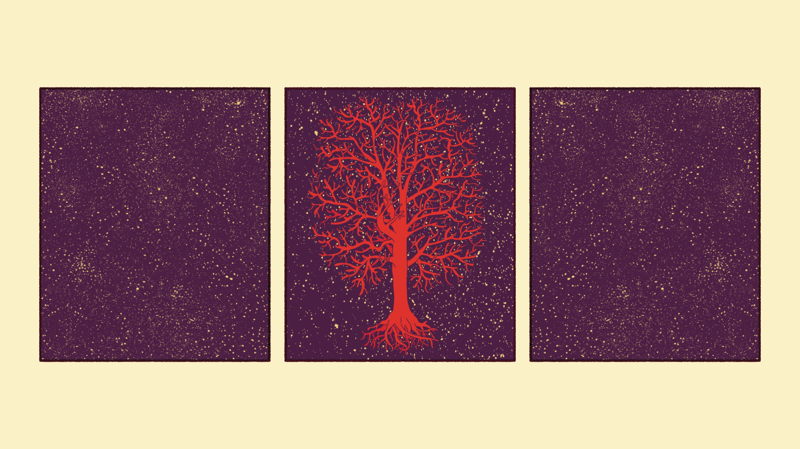<br>**beige_tree.png**|<br>**berserkdrac.png**|
|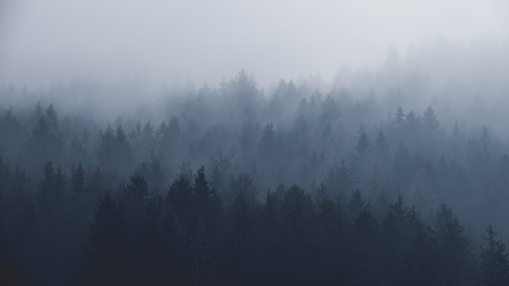<br>**bg_19.jpg**|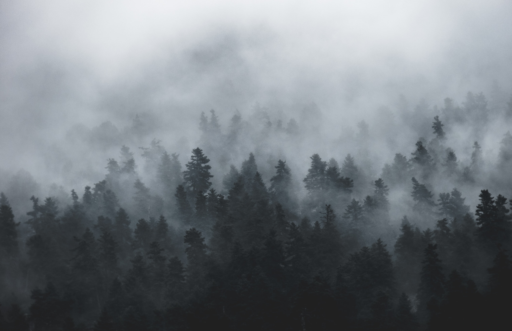<br>**bg_20.jpg**|

### kanagawa (3 wallpapers)

|||
|-|-|
|<br>**kanagawa-inverted-darker.jpg**|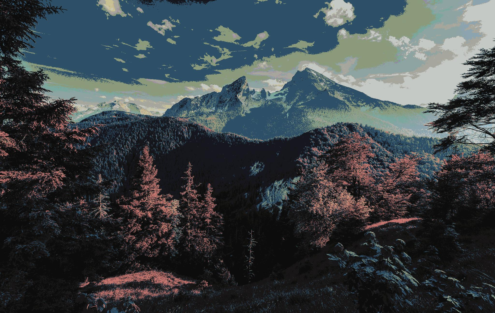<br>**mountain_kanagawa-dragon.jpg**|
|<br>**sunset_kanagawa-dragon.jpg**||

### nordic (115 wallpapers)

|||
|-|-|
|<br>**anime-eye-nord.png**|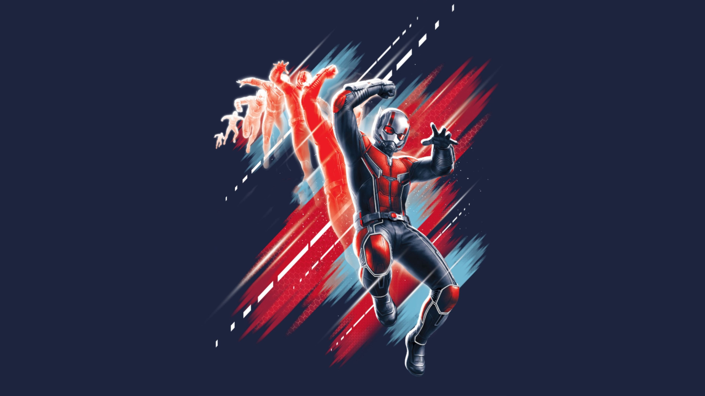<br>**Antman.jpg**|
|<br>**arch-chan_to.png**|<br>**astronaut-balloons.jpg**|
|<br>**astronaut-nord.png**|<br>**astronaut-planet.jpg**|

### rosepine (35 wallpapers)

|||
|-|-|
|<br>**anime_blood.jpg**|<br>**awesome-landscape.png**|
|<br>**bg_13.jpg**|<br>**blade3.png**|
|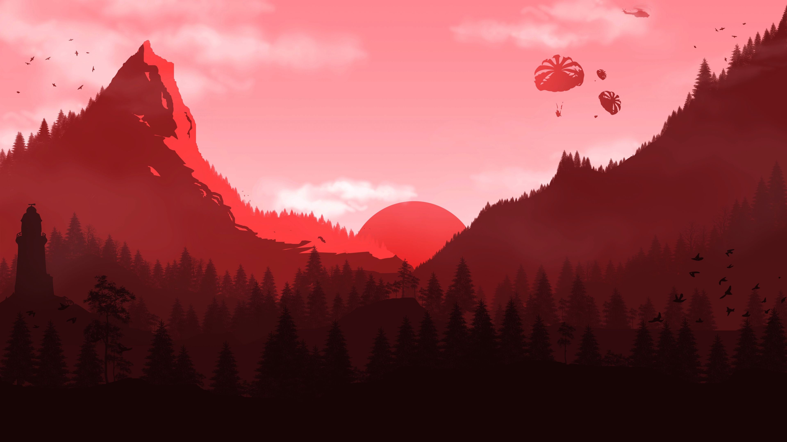<br>**BloodJungles.jpg**|<br>**burning_cherry.jpeg**|

### solarized (11 wallpapers)

|||
|-|-|
|<br>**chinatown.png**|<br>**city-buildings.png**|
|<br>**crane.jpg**|<br>**crow.png**|
|<br>**darkness.jpg**|<br>**judy.png**|

### tokyonight (105 wallpapers)

|||
|-|-|
|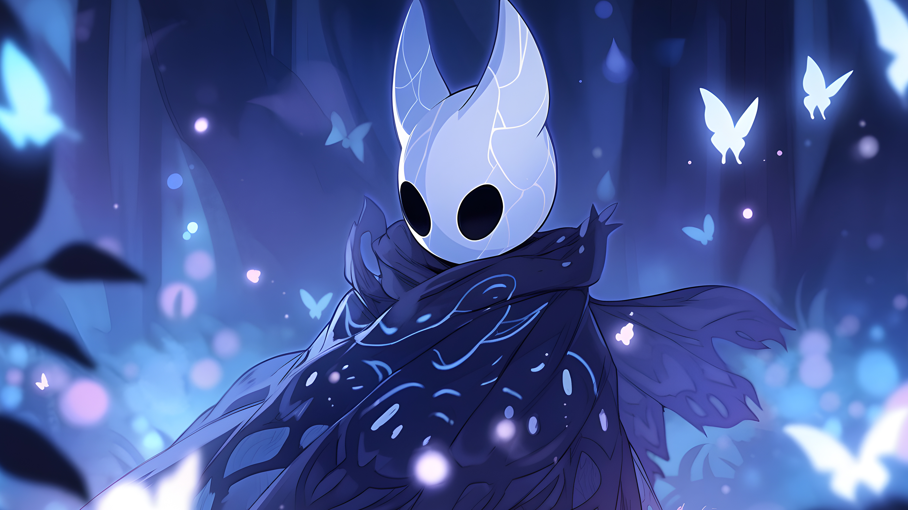<br>**aesthetic-hollow-knight-purple-desktop-wallpaper.jpg**|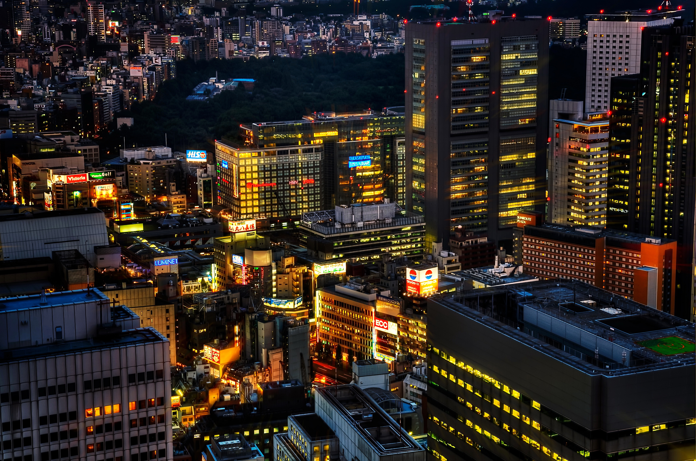<br>**Aesthetic_Japan_Wallpapers.jpg**|
|<br>**alex-knight-5-GNa303REg-unsplash.jpg**|<br>**alfa.png**|
|<br>**amilia.jpg**|<br>**anime-chick.jpg**|

### unorganized (126 wallpapers)

|||
|-|-|
|<br>**abstract.jpg**|<br>**android-dark-lines.jpg**|
|<br>**android-sakura.jpg**|<br>**anime-nord.png**|
|<br>**arch-eagle.png**|<br>**arch-nord-dark.png**|


## Credits

Special thanks to every wallpaper creator. If you are the creator of any wallpaper here and would like attribution or removal, please [open an issue](https://github.com/yourusername/wallpapers/issues).

## License

MIT License - See [LICENSE](LICENSE) file for details.
